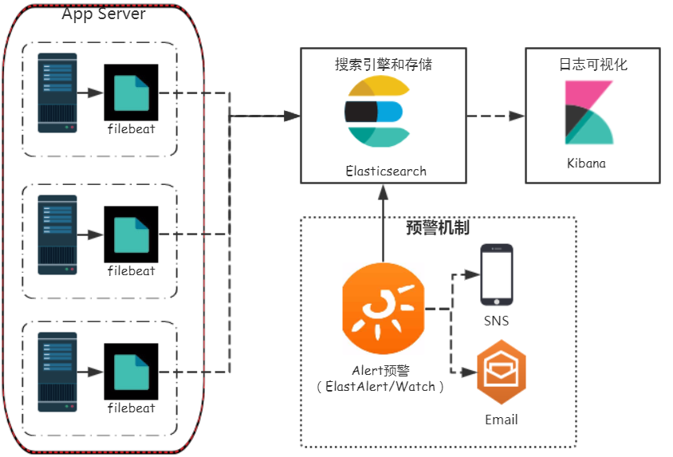

## Spring Cloud Quick Start - 日志集成EFK 
其实日志集成ELK/EFK本身与Spring Cloud没有太大关系，只是作为日志分析生态技术说明。  
本文使用 Elasticsearch + FileBeat + Kibana做简单日志分析。    
通常EFK也指（Elasticsearch + Fluentd + Kibana），本文不针对Fluentd说明。  

这里简单使用EFK方案演示（实际生产可能还会加上kafka作为缓冲，或是还加上logstash做复杂过滤 ）  
  


### 实验环境说明  

* Spring Cloud - Finchley.M9
* Spring Boot - 2.0.0.RELEASE     
* Maven(实验环境为了方便，使用maven进行)  
* Elasticsearch 5.4.1(最新为6.*版本)

### 服务项目名称  
仅以下Spring Cloud两个微服务进行日志集成：  
服务1：test-eureka-client1   
服务2：test-eureka-client2   


    
### 引入json日志输出依赖包   
为了让日志以json格式输出，便于filebeat进行日志提取，以引入`logstash-logback-encoder`包：  

``` xml    
	<dependency>
			<groupId>net.logstash.logback</groupId>
			<artifactId>logstash-logback-encoder</artifactId>
			<version>4.9</version>
		</dependency>
```  
 

#### 日志配置文件  
`logback-spring.xml`中配置信息，主要进行路由的配置：     
 
``` xml
<?xml version="1.0" encoding="UTF-8"?>

<!--
     Logback configuration for Structured Logging in Spring Boot projects.
     Includes support for Spring Cloud Sleuth, based on Spring Boot's
     defaults and a sample from the reference manual of Sleuth.
-->

<configuration>
    <include resource="org/springframework/boot/logging/logback/defaults.xml"/>

    <!-- Don't forget to set "spring.application.name" in application.yml -->
    <springProperty scope="context" name="springAppName" source="spring.application.name"/>
    <property name="LOG_FILE" value="${LOG_FILE:-${LOG_PATH:-logs}/${springAppName}}"/>

    <!-- Appender to log to console in plain text format -->
    <appender name="CONSOLE" class="ch.qos.logback.core.ConsoleAppender">
        <filter class="ch.qos.logback.classic.filter.ThresholdFilter">
            <!-- Minimum logging level to be presented in the console logs-->
            <level>DEBUG</level>
        </filter>
        <encoder>
            <pattern>${CONSOLE_LOG_PATTERN}</pattern>
            <charset>utf8</charset>
        </encoder>
    </appender>

    <!-- Appender to log to file in plain text format -->
    <appender name="FILE" class="ch.qos.logback.core.rolling.RollingFileAppender">
        <file>${LOG_FILE}</file>
        <rollingPolicy class="ch.qos.logback.core.rolling.TimeBasedRollingPolicy">
            <fileNamePattern>${LOG_FILE}.%d{yyyy-MM-dd}.gz</fileNamePattern>
            <maxHistory>7</maxHistory>
        </rollingPolicy>
        <encoder>
            <pattern>${FILE_LOG_PATTERN}</pattern>
            <charset>utf8</charset>
        </encoder>
    </appender>

    <!-- Appender to log to file in a JSON format, one JSON object per line -->
    <appender name="JSON_FILE" class="ch.qos.logback.core.rolling.RollingFileAppender">
        <file>${LOG_FILE}.json</file>
        <rollingPolicy class="ch.qos.logback.core.rolling.TimeBasedRollingPolicy">
            <fileNamePattern>${LOG_FILE}.json.%d{yyyy-MM-dd}.gz</fileNamePattern>
            <maxHistory>7</maxHistory>
        </rollingPolicy>
        <encoder class="net.logstash.logback.encoder.LoggingEventCompositeJsonEncoder">
            <providers>
                <!-- Log all StructuredArgument instances -->
                <arguments/>
                <!-- Log all MDC fields except the ones from Sleuth - we add them below
                     under cleaned up names -->
                <mdc>
                    <excludeMdcKeyName>X-B3-TraceId</excludeMdcKeyName>
                    <excludeMdcKeyName>X-B3-SpanId</excludeMdcKeyName>
                    <excludeMdcKeyName>X-B3-ParentSpanId</excludeMdcKeyName>
                    <excludeMdcKeyName>X-Span-Export</excludeMdcKeyName>
                </mdc>
                <!-- Include Exception stack traces -->
                <stackTrace/>
                <timestamp>
                    <timeZone>UTC</timeZone>
                </timestamp>
                <!-- Assign logger fields to JSON object -->
                <pattern>
                    <pattern>
                        {
                            "severity": "%level",
                            "service": "${springAppName:-}",
                            "trace": "%X{X-B3-TraceId:-}",
                            "span": "%X{X-B3-SpanId:-}",
                            "parent": "%X{X-B3-ParentSpanId:-}",
                            "exportable": "%X{X-Span-Export:-}",
                            "pid": ${PID:-},
                            "thread": "%thread",
                            "logger": "%logger",
                            "message": "%message"
                        }
                    </pattern>
                </pattern>
            </providers>
        </encoder>
    </appender>

    <root level="INFO">
        <appender-ref ref="CONSOLE"/>
        <appender-ref ref="FILE"/>
        <appender-ref ref="JSON_FILE"/>
    </root>

</configuration>

```        
   
### filebeat配置文件   
添加日志文件路径信息配置、ES服务端配置 
``` yml  
- input_type: log

  # Paths that should be crawled and fetched. Glob based paths.
  paths:
    - F:\practice\spring-cloud\test-eureka-client1\*.log.json
    - F:\practice\spring-cloud\test-eureka-client2\*.log.json    
	
	
	
output.elasticsearch:
  # Array of hosts to connect to.
  hosts: ["192.168.3.181:9200"]
```   

### 运行  
* 启动服务后，在url上浏览：`http://localhost:8764/hic?name=123`,隔几秒后发现ES上以有两个服务日志信息。可基于TraceId进行日志聚合检索  


### 日志预警    
以node.js预警服务，简单演示如果发现有fallback日志，进行邮件通知。
  


