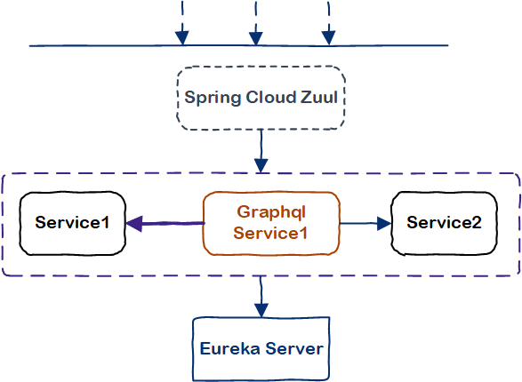

## Spring Cloud Quick Start - Graphql集成  
将test-graphql作为eureka client的服务。其中test-graphql自宿主了几个graphql query API接口，  
然后调用test-eureka-client1服务接口提供了另外一个graphql query API接口。  
结构示意：  
    
>  这里暂未明确graphql服务所在位置，理论上应该还得往外延伸，一直到与zuul平行？

### 实验环境说明  

* Spring Cloud - Finchley.M9
* Spring Boot - 2.0.1.RELEASE     
* Maven(实验环境为了方便，使用maven进行) 

### 服务项目名称
服务注册中心：test-eureka-server  
服务1：test-eureka-client1   
__服务2：test-graphql(本文)__   
路由服务：test-zuul    
Spring Boot管理服务：boot-admin

### 服务test-graphql         
>  坑： spring-cloud-openfeign之前使用的版本2.0.0.M1貌似与graphql有冲突，无法集成。后来换为2.0.0.RC1后可以。  

#### 引入`graphql`依赖包   
这里使用的是`graphql-spring-boot-starter`,`graphiql-spring-boot-starter` 、`graphql-java-tools`  
 
``` xml    
		<dependency>
			<groupId>com.graphql-java</groupId>
			<artifactId>graphql-spring-boot-starter</artifactId>
			<version>4.0.0</version>
		</dependency>

		<dependency>
			<groupId>com.graphql-java</groupId>
			<artifactId>graphiql-spring-boot-starter</artifactId>
			<version>4.0.0</version>
		</dependency>


		<dependency>
			<groupId>com.graphql-java</groupId>
			<artifactId>graphql-java-tools</artifactId>
			<version>4.3.0</version>
		</dependency>
```  

#### 完整`pom`配置信息  
``` xml  
 <?xml version="1.0" encoding="UTF-8"?>
<project xmlns="http://maven.apache.org/POM/4.0.0" xmlns:xsi="http://www.w3.org/2001/XMLSchema-instance"
	xsi:schemaLocation="http://maven.apache.org/POM/4.0.0 http://maven.apache.org/xsd/maven-4.0.0.xsd">
	<modelVersion>4.0.0</modelVersion>

	<groupId>com.test</groupId>
	<artifactId>test-graphql</artifactId>
	<version>0.0.1-SNAPSHOT</version>
	<packaging>jar</packaging>

	<name>test-graphql</name>
	<description>Demo project for Spring Boot</description>

	<parent>
		<groupId>org.springframework.boot</groupId>
		<artifactId>spring-boot-starter-parent</artifactId>
		<version>2.0.1.RELEASE</version>
		<relativePath/> <!-- lookup parent from repository -->
	</parent>

	<properties>
		<project.build.sourceEncoding>UTF-8</project.build.sourceEncoding>
		<project.reporting.outputEncoding>UTF-8</project.reporting.outputEncoding>
		<java.version>1.8</java.version>
		<spring-cloud.version>Finchley.M9</spring-cloud.version>
	</properties>

	<dependencies>
		<dependency>
			<groupId>org.springframework.cloud</groupId>
			<artifactId>spring-cloud-starter-netflix-eureka-client</artifactId>
		</dependency>
		<dependency>
			<groupId>org.springframework.cloud</groupId>
			<artifactId>spring-cloud-starter-openfeign</artifactId>
		</dependency>

		<dependency>
			<groupId>com.graphql-java</groupId>
			<artifactId>graphql-spring-boot-starter</artifactId>
			<version>4.0.0</version>
		</dependency>

		<dependency>
			<groupId>com.graphql-java</groupId>
			<artifactId>graphiql-spring-boot-starter</artifactId>
			<version>4.0.0</version>
		</dependency>


		<dependency>
			<groupId>com.graphql-java</groupId>
			<artifactId>graphql-java-tools</artifactId>
			<version>4.3.0</version>
		</dependency>

		<dependency>
			<groupId>org.springframework.boot</groupId>
			<artifactId>spring-boot-starter-web</artifactId>
		</dependency>

		<dependency>
			<groupId>org.springframework.boot</groupId>
			<artifactId>spring-boot-starter-test</artifactId>
			<scope>test</scope>
		</dependency>
	</dependencies>

	<dependencyManagement>
		<dependencies>
			<dependency>
				<groupId>org.springframework.cloud</groupId>
				<artifactId>spring-cloud-dependencies</artifactId>
				<version>${spring-cloud.version}</version>
				<type>pom</type>
				<scope>import</scope>
			</dependency>
			<dependency>
				<groupId>org.springframework.cloud</groupId>
				<artifactId>spring-cloud-openfeign</artifactId>
				<version>2.0.0.RC1</version>
				<type>pom</type>
				<scope>import</scope>
			</dependency>
		</dependencies>
	</dependencyManagement>

	<build>
		<plugins>
			<plugin>
				<groupId>org.springframework.boot</groupId>
				<artifactId>spring-boot-maven-plugin</artifactId>
			</plugin>
		</plugins>
	</build>

	<repositories>
		<repository>
			<id>spring-milestones</id>
			<name>Spring Milestones</name>
			<url>https://repo.spring.io/milestone</url>
			<snapshots>
				<enabled>false</enabled>
			</snapshots>
		</repository>
	</repositories>
</project>

```  

#### 配置文件  
`bootstrap.yml`中配置信息：    
主要定义了服务名称
``` yml
eureka:
  client:
    serviceUrl:
      defaultZone: http://192.168.3.181:8761/eureka/
spring:
  application:
    name: graphql-todo-app
server:
  port: 9000
graphiql:
  mapping: /graphiql
  endpoint: /graphql
  enabled: true
  pageTitle: GraphiQL
```  

#### 启动服务发现注解配置    
添加`@EnableEurekaClient`  和 `@EnableFeignClients`

``` java  
@SpringBootApplication
@EnableDiscoveryClient
@EnableFeignClients
public class EurekaClient1Application {

	public static void main(String[] args) {
		SpringApplication.run(EurekaClient1Application.class, args);
	}
}
  
```       

#### 定义graphql schema  
在`resources`文件夹下新增`blog.graphqls`文件：  
   
``` java  
 type Post {
    id: ID!
    title: String!
    text: String!
    category: String
    author: Author
}

type Author {
    id: ID!
    name: String!
    thumbnail: String
    posts: [Post]!
}

type Message {
    id: ID
    name: String!
}

# The Root Query for the application
type Query {
    recentPosts(count: Int, offset: Int): [Post]!
    auPosts(authorId:String): [Post]!
    getService1Str(name:String): Message
}

# The Root Mutation for the application
type Mutation {
    writePost(title: String!, text: String!, category: String, author: String!) : Post!
}

```      

 
#### 定义pojo  
`Author`和`Post`：  

``` java  
package com.test;

public class Author {
    private String id;
    private String name;
    private String thumbnail;

    public String getId() {
        return id;
    }

    public void setId(String id) {
        this.id = id;
    }

    public String getName() {
        return name;
    }

    public void setName(String name) {
        this.name = name;
    }

    public String getThumbnail() {
        return thumbnail;
    }

    public void setThumbnail(String thumbnail) {
        this.thumbnail = thumbnail;
    }
}

```   

#### 定义Dao    
定义`AuthorDao`和`PostDao`  

```   
@Component
public class AuthorDao {
    private List<Author> authors;

    public AuthorDao(List<Author> authors) {
        this.authors = authors;
    }

    public Optional<Author> getAuthor(String id) {
        return authors.stream().filter(author -> id.equals(author.getId())).findFirst();
    }
}

```     

#### 定义GraphQLResolver    
`AuthorResolver`与`PostResolver`：  

```  
@Component
public class AuthorResolver implements GraphQLResolver<Author> {
    private PostDao postDao;

    public AuthorResolver(PostDao postDao) {
        this.postDao = postDao;
    }

    public List<Post> getPosts(Author author) {
        return postDao.getAuthorPosts(author.getId());
    }
}  
```    

#### 定义GraphQLQueryResolver   
```  java  
@Component
public class Query implements GraphQLQueryResolver {
    private PostDao postDao;
    @Autowired
    IServiceHi iServiceHi;

    public Query(PostDao postDao) {
        this.postDao = postDao;
    }

    public List<Post> recentPosts(int count, int offset) {
        return postDao.getRecentPosts(count, offset);
    }

    public List<Post> auPosts(String authorId) {
        return postDao.getAuthorPosts(authorId);
    }

    public Message getService1Str(String name) {
        String rlt = iServiceHi.sayHiFromClientOne(name);
        Message msg = new Message();
        msg.setId("1");
        msg.setName(rlt);
        return msg;
    }
}

  
``` 

#### 运行  
启动服务后，在url上浏览`http://localhost:9000/graphiql?`     
即可执行`graphql`查询。  


 

